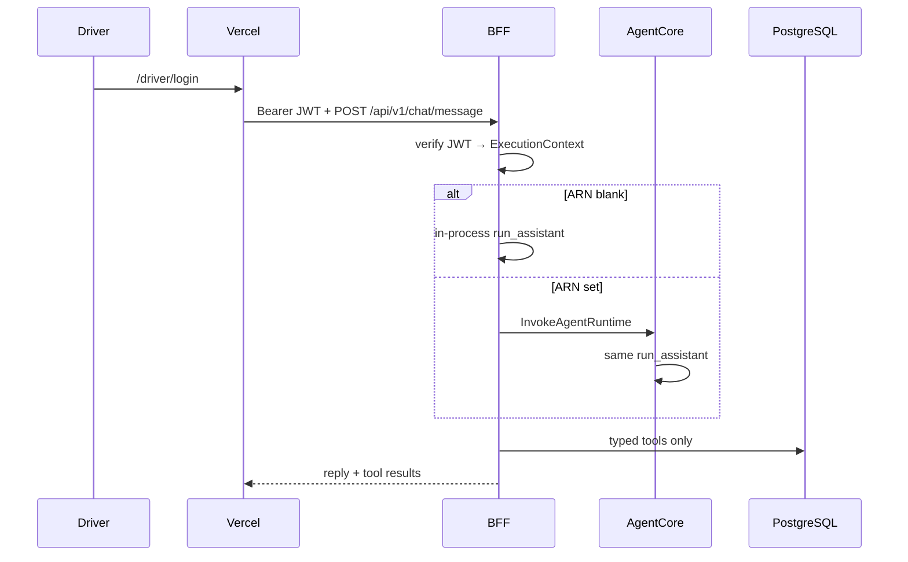
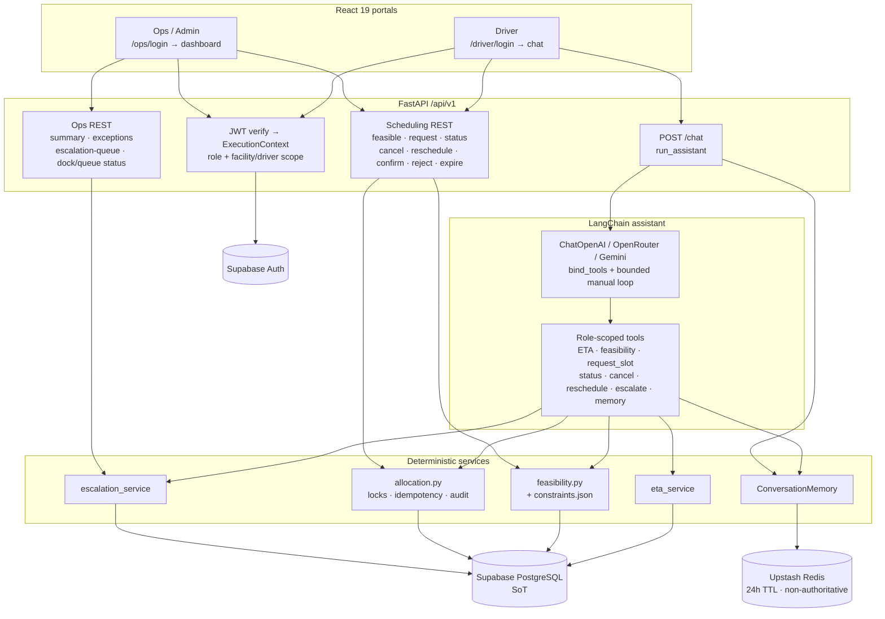
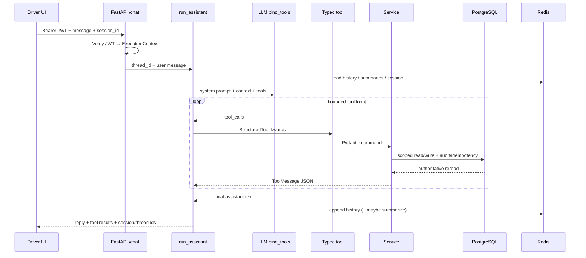
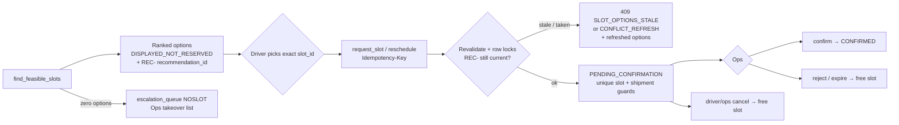

# SetuHaul AI

> AI-Powered Driver Exception Management & Dock Scheduling Platform (FDE POC)


---

## Status (read this first)

Sprint 1–3 exit gates are **COMPLETE** (Sprint 3 closed 2026-08-12). Sprint 4 hosting is **in progress on `main`** — Steps 1–9 evidenced; Locust Suite A ran (not clean); Suite B not run. **Do not strike the Sprint 4 gate** until Suite B + Express cleanup. Command book: [plans/sprint-4-hosting.md](plans/sprint-4-hosting.md). Living scoreboard: [plans/implementation-master-plan.md](plans/implementation-master-plan.md).

| Sprint | Gate | What landed |
|---|---|---|
| 1 – Trusted walking skeleton | COMPLETE | Two portals, JWT `/auth/me`, CI |
| 2 – Exception / ETA vertical slice | COMPLETE | Driver chat, confirmed ETA write, Redis 24h memory |
| 3 – Deterministic allocation | COMPLETE | Feasible options, `request_slot`, race/NOSLOT/cancel, escalation, 10×4 live pytest |
| 3+ demo-hardening | COMPLETE | Cast reset, stale `REC-`, Dispatch Console, extra Driver tools |
| 4 – Hosting, AgentCore, Locust | **OPEN** | Vercel + ECS Express BFF + AgentCore Runtime; Locust Suite B remaining |

**Hosted (public — no secrets)**

| What | URL |
|---|---|
| SPA | https://setuhaul-roan.vercel.app (`/driver/login`, `/ops/login`, `/dispatch`) |
| BFF | `https://se-e5cad5d30b1a4f22b9aeea032827f81b.ecs.us-east-1.on.aws` (`/health/live`, `/docs`) |
| Local UI / API | `http://localhost:5173` · `http://127.0.0.1:8000` |

Laptop Windows DNS sometimes NXDOMAINs `*.on.aws`; public 8.8.8.8 works. Recreating Express Mode **changes** the BFF URL → rebuild Vercel `VITE_API_BASE_URL`.

```text
Laptop:  Vite :5173 → uvicorn :8000 → in-process run_assistant   (leave AGENTCORE_RUNTIME_ARN blank)
Hosted:  Vercel SPA → FastAPI BFF (JWT) → IAM InvokeAgentRuntime → same run_assistant
```

The SPA never holds AWS creds. The Runtime **ARN is not a URL** and is **never** in `VITE_*`. Only the hosted BFF uses it (Step 9). Login, `/auth/me`, Ops, Dispatch, and slot REST never need the ARN.

**What you can demo today**

- Driver chat with typed tools + confirmed ETA write (idempotent)
- Ops/Admin dashboard + escalation list; **Dispatch Console** (`/dispatch`) auto-books an initial slot
- Deterministic ranked `find_feasible_slots` (options are **not reserved**)
- Transactional `request_slot` → `PENDING_CONFIRMATION` (conflict-safe refresh)
- Status, cancel, reschedule; ops confirm / reject / expire
- Stale `REC-` rejection after ETA / option drift
- NOSLOT → durable `escalation_queue` (no invented slot)
- Same-slot race + live 10×4 pytest (zero double-books)
- Extra Driver tools: vehicle/carrier, gate/queue, facility rules, breakdown, dock alerts
- **Hosted:** Vercel login → Express BFF → AgentCore; CloudWatch Runtime logs + LangSmith project `setuhaul-agentcore` / run `setuhaul.chat`

**Still open / do not claim**

- Locust Suite B (10 CONTEND drivers, zero double-books) **not run**
- Locust Suite A (2026-08-14): `auth_me` 5/5; one Amit C2 **503** — hosting not clean
- Sprint 4 exit gate + delete Express Mode after demo (ALB bills idle ~$0.08/hr)
- Facility-wide OR-Tools (PDF §7.3 optional)
- Password rotation / session revocation (post-demo)
- Maps, GPS, messaging channels
- Formal Playwright suite in CI

**Teammates need (or you are missing the run)**

1. Gitignored `POC_TEAM_ACCOUNTS.local.md` (three role passwords — never commit / never paste in chat)
2. Gitignored `.env` / `.env.local` + `frontend/.env.local` (see table below)
3. For AgentCore/ECS: AWS CLI logged in (`us-east-1`); `agentcore.cmd` on PATH
4. For Locust: `uv` on PATH; same password file + Vite Supabase keys
5. Cast reset before a shared Ravi show or Locust Suite B

### Run locally

Use **`http://localhost:5173`** for the UI (CORS allows both localhost and 127.0.0.1).

```bash
# 1) Env (never commit real secrets)
cp .env.example .env
# Fill Supabase, DATABASE_URL, at least one LLM key, Upstash.
# Frontend Vite vars also go in frontend/.env.local (see table below).
# Shared demo passwords live in gitignored POC_TEAM_ACCOUNTS.local.md (owner-shared).

# 2) Backend
cd backend
python -m venv .venv
# Windows: .venv\Scripts\activate
# macOS/Linux: source .venv/bin/activate
pip install -r requirements.txt
uvicorn app.main:app --host 127.0.0.1 --port 8000 --reload

# 3) Frontend (second terminal)
cd frontend
npm install
npm run dev
```

API: `http://127.0.0.1:8000` (root `/` is an alive health ping; also `/health/live`, `/health/ready`, `/docs`) · UI: `http://localhost:5173`

**Reset between shared demos** (undo ETA/slot/chat residue; does not change Auth passwords):

```powershell
python supabase/demo/reset_demo_day.py --mode cast --include-shp1017 --confirm
```

### Environment variables

| Variable | Where | Purpose |
|---|---|---|
| `SUPABASE_URL`, `SUPABASE_ANON_KEY` | root `.env` | Auth / JWKS |
| `VITE_SUPABASE_URL`, `VITE_SUPABASE_ANON_KEY`, `VITE_API_BASE_URL` | `frontend/.env.local` | Browser client |
| `SUPABASE_SERVICE_ROLE_KEY`, `DATABASE_URL` | root `.env` only | Backend DB / admin (never in browser) |
| `LLM_PROVIDER`, `LLM_MODEL` | root `.env` | `auto` \| `openai` \| `openrouter` \| `gemini` |
| `OPENAI_API_KEY` / `OPENROUTER_API_KEY` / `GOOGLE_API_KEY` | root `.env` | LLM (`auto` = OpenAI → OpenRouter → Gemini) |
| `UPSTASH_REDIS_REST_URL`, `UPSTASH_REDIS_REST_TOKEN` | root `.env` | Chat memory (24h TTL, non-authoritative) |
| `LANGSMITH_API_KEY`, `LANGSMITH_TRACING` | root `.env` | Optional tracing |
| `CORS_ORIGINS` / `CORS_ORIGIN_REGEX` | root `.env` | Local Vite + `https://*.vercel.app` |
| `AGENTCORE_RUNTIME_ARN` | hosted BFF only | **Blank on laptop.** Set on Express after Runtime deploy. Never `VITE_*`. |
| `AWS_REGION` | BFF / Runtime | `us-east-1` |
| `LANGSMITH_PROJECT` | Runtime / `.env` | `setuhaul-agentcore` |
| `SETUHAUL_RUN_LIVE_DB_TESTS=1` | shell only | Opt-in live integration proofs (needs `DATABASE_URL`) |
| `SETUHAUL_BFF_URL` / `SETUHAUL_LOCUST_MUTATE` | Locust shell | Host override; mutate=1 only for 1–2 user C5/E5 |

Copy from [`.env.example`](.env.example). Never commit real keys or passwords.

### Demo login details

Passwords are **not** in git. Owner shares them privately via gitignored `POC_TEAM_ACCOUNTS.local.md`. Keep the **same three shared role buckets** until after demo (no password resets).

| Portal | Local | Hosted | Email |
|---|---|---|---|
| Driver | `http://localhost:5173/driver/login` | https://setuhaul-roan.vercel.app/driver/login | `ravi.kumar@setuhaul.com` (also amit.singh, vikas.sharma, `driver.drv004@…`–`drv015@…`) |
| Ops | `http://localhost:5173/ops/login` | https://setuhaul-roan.vercel.app/ops/login | `priya.mehta@setuhaul.com` (also kavita.rao, arvind.nair, …) |
| Admin | same Ops login | same | `admin@setuhaul.com` / `ananya.rao@setuhaul.com` |
| Dispatch | `http://localhost:5173/dispatch` | https://setuhaul-roan.vercel.app/dispatch | Ops JWT |

These emails are seeded in Supabase Auth and mapped via `users.auth_user_id`. Same password per bucket.

### Demo script (Sprint 2–3; same beats hosted)

Demo-day cast remains a frozen **2026-08-16** scenario (`Asia/Kolkata`); the FDE presentation is **2026-08-17** — keep 16 Aug ETA strings. Checklist: [docs/PRESENTATION_CHECKLIST.md](docs/PRESENTATION_CHECKLIST.md). **Full ordered manual test:** [docs/DEMO_MANUAL_RUNBOOK.md](docs/DEMO_MANUAL_RUNBOOK.md). Quick prompts: [docs/DEMO_DRIVER_CHAT_SCRIPT.md](docs/DEMO_DRIVER_CHAT_SCRIPT.md). Judge sheet: [docs/DEMO_DAY_READINESS.md](docs/DEMO_DAY_READINESS.md).

1. Open Driver login → sign in as **Ravi**.
2. If asked which shipment, choose **`SHP-D16-RAVI`** (not older `SHP1017`).
3. Report delay / confirm an exact ETA with timezone when prompted.
4. Ask for later slots → ranked **non-reserved** options (`find_feasible_slots`).
5. Request an exact `slot_id` → `PENDING_CONFIRMATION` (`request_slot`). Check status; warehouse has not confirmed yet.
6. Optional: cancel → slot capacity frees for a later search.
7. Two browsers: Ravi (`SHP-D16-RACE-A`) and Amit (`SHP-D16-RACE-B`) both request **`D16-SLT-RACE`** → one winner, one conflict refresh.
8. **Vikas:** slots for **`SHP-D16-NOSLOT`** → zero options + escalation (no invented slot); Ops sees the escalation queue.
9. Ops login → dashboard / escalation list → confirm or reject a pending appointment.

Locust is **hosted load**, not this walkthrough. HTTP 200 ≠ Phase A–G PASS. Commands: **Sprint 4 teammate commands** below.

### LLM providers

Runtime uses a bounded manual `run_assistant` loop with **`bind_tools`** (not `create_agent` / AgentExecutor).

| Provider | Env | LangChain class |
|---|---|---|
| OpenAI | `OPENAI_API_KEY` | `ChatOpenAI` |
| OpenRouter | `OPENROUTER_API_KEY` | `ChatOpenAI` + OpenRouter base URL |
| Gemini | `GOOGLE_API_KEY` (Google AI Studio / Gemini API) | `ChatGoogleGenerativeAI` (default `gemini-flash-latest`) |

- `LLM_PROVIDER=auto` (default): first available among OpenAI → OpenRouter → Gemini
- Explicit: set `LLM_PROVIDER=openai|openrouter|gemini` and that provider’s key
- Optional `LLM_MODEL` overrides the default model for the chosen provider
- Do **not** put an OpenAI `sk-` / `sk-proj-` key in `GOOGLE_API_KEY`; default Gemini model is `gemini-flash-latest`.

---

## Sprint 4 teammate commands

Full click-path and punch-list: [plans/sprint-4-hosting.md](plans/sprint-4-hosting.md). Run from **repo root** unless noted. Never print SSM `--with-decryption`, tokens, or passwords.

### Local (ARN blank)

```powershell
Set-Location backend; uvicorn app.main:app --host 127.0.0.1 --port 8000 --reload
# other terminal
Set-Location frontend; npm run dev
```

### Docker API (laptop)

```powershell
Set-Location backend
docker build --platform linux/amd64 -t setuhaul-api .
docker run --rm -p 18000:8000 -e PORT=8000 --env-file ..\.env setuhaul-api
# then GET http://127.0.0.1:18000/health/live
```

Leave `AGENTCORE_RUNTIME_ARN` blank in that env file so the container stays in-process.

### AgentCore (Windows CLI)

Runtime already exists as `SetuHaulAgent`. Re-stage CodeZip before a code deploy (`pyproject.toml` must sit at `agentcore/codezip/`):

```powershell
python docs/scripts/stage_agentcore_codezip.py
agentcore.cmd validate
agentcore.cmd deploy --dry-run --yes
agentcore.cmd deploy --yes
agentcore.cmd status
$SESSION = "setuhaul-dev-session-" + (Get-Date -Format "yyyyMMddHHmmss")
agentcore.cmd invoke --runtime SetuHaulAgent --session-id $SESSION --prompt-file docs/scripts/agentcore_invoke_ravi.json
agentcore.cmd logs --runtime SetuHaulAgent --since 15m
```

- Save the Runtime ARN in gitignored `.env` only. Set it on the **Express BFF**, not Vercel, not the laptop.
- First-time create (already done): `agentcore.cmd create --name SetuHaulAgent --framework LangChain_LangGraph --protocol HTTP --model-provider Gemini --memory none --build CodeZip`
- Hosted chat smoke (needs local env + Driver password file): `python docs/scripts/smoke_hosted_step9.py`
- Traces: CloudWatch → GenAI Observability → Bedrock AgentCore. LangSmith project `setuhaul-agentcore`, run name `setuhaul.chat` (turn off `Is Trace is true`).

Do **not** rebuild Vercel when only the BFF ARN changes.

### Locust (laptop → hosted BFF)

Needs `POC_TEAM_ACCOUNTS.local.md` + `.env.local` Vite keys. Locust does **not** open the Vercel login page (Supabase grant + JWT). Default host is the Express BFF (`-H` or `SETUHAUL_BFF_URL` to override).

```powershell
# Suite A — web UI http://127.0.0.1:8089  then Start: 5 users / 1 per second
uv run --with locust locust -f loadtests/locust_runbook_chat.py --web-host 127.0.0.1 --web-port 8089

# Suite A — headless (LLM; keep short)
uv run --with locust locust -f loadtests/locust_runbook_chat.py --headless -u 5 -r 1 -t 3m

# Suite B — reset first; 409 conflict = pass; two winners on one slot = fail
python supabase/demo/reset_demo_day.py --mode cast --include-shp1017 --confirm
uv run --with locust locust -f loadtests/locust_slot_contention.py --headless -u 10 -r 10 -t 90s
```

Do not spawn 20+ chat users. `SETUHAUL_LOCUST_MUTATE=1` only for a 1–2 user C5/E5 walk. Details: [loadtests/README.md](loadtests/README.md).

### After the demo

Delete Express Mode (ALB bills while idle). A new Express URL requires a Vercel rebuild. Strike the Sprint 4 gate only with Steps 7–10 evidence + secrets not in git.

---

## Overview

SetuHaul is an FDE logistics POC: drivers report delays and update ETA through a conversational assistant; the system returns deterministic, explainable slot options and concurrency-safe appointment claims; operations see facility-scoped (or global Admin) dashboards and an escalation queue for human takeover. PostgreSQL (Supabase) is the business source of truth; Upstash Redis holds bounded conversation/session state only (24h TTL, non-authoritative).

---

## POC portals

| Portal | Routes |
|---|---|
| Driver | `/driver/login` → driver chat home (ETA + scheduling tools) |
| Operations | `/ops/login` → shared Operator/Admin dashboard + escalation list (JWT sets facility vs global RO) |
| Dispatch | `/dispatch` → create shipment + auto-book first feasible slot (ops JWT) |

---

## Architecture (Sprint 3 product + Sprint 4 dual-mode)

Same FastAPI + `run_assistant` locally and hosted. Hosted chat is JWT on the BFF, then `InvokeAgentRuntime` when `AGENTCORE_RUNTIME_ARN` is set. Scheduling REST never goes through AgentCore.



Two portals share one FastAPI BFF. The LLM never books slots or invents ETAs — it only orchestrates **typed tools** that call deterministic services. PostgreSQL is the business source of truth; Upstash Redis is 24h non-authoritative chat/session memory only.

### System context



### Driver chat turn (exact path)



### Scarce-capacity allocation (exact path)



Packages: `backend/app/assistant/` (LLM factory, `run_assistant`, tools, prompts) and `backend/app/scheduling/` (`feasibility.py`, `allocation.py`, `constraints.json`). Full write-up: [docs/ARCHITECTURE.md](docs/ARCHITECTURE.md).

---

## Technology stack

| Layer | Technology |
|---|---|
| Frontend | React 19 + TypeScript + Vite |
| Backend | FastAPI (thin routers → services → repositories) |
| AI | LangChain `bind_tools` manual loop (OpenAI / OpenRouter / Gemini) |
| Scheduling | Deterministic feasibility + transactional allocation (PostgreSQL locks / unique indexes) |
| Database | Supabase PostgreSQL |
| Memory | Upstash Redis (24h TTL, non-authoritative) |
| Auth | Supabase Auth + server-side JWT verification |
| Observability | LangSmith (`setuhaul-agentcore` / `setuhaul.chat`) + CloudWatch AgentCore |
| Hosted SPA | Vercel (`setuhaul-roan.vercel.app`) |
| Hosted BFF | ECS Express Mode (App Runner rejected new accounts) |
| Hosted assistant | Bedrock AgentCore Runtime `SetuHaulAgent` (same `run_assistant`) |
| Load | Locust Suite A (chat) + Suite B (CONTEND REST) |

---

## Project layout

```
SetuHaul/
├── backend/app/          # FastAPI API + assistant + scheduling + services
├── frontend/             # React 19 frontend
├── supabase/migrations/  # SQL migrations
├── supabase/demo/        # Demo-day 2026-08-16 generator + cast fixtures
├── plans/                # Living master plan + branch plans
├── wiki/                 # LLMWiki (handoff, current-state, …)
├── docs/                 # Architecture / ADRs / demo readiness / scripts
├── loadtests/            # Locust Suite A (chat) + Suite B (scarce slots)
├── agentcore/            # AgentCore project + staged CodeZip (no secrets)
├── .env.example
├── PROJECT.md
└── README.md
```

---

## Documentation

| File | Description |
|---|---|
| [PROJECT.md](PROJECT.md) | Product scope |
| [plans/implementation-master-plan.md](plans/implementation-master-plan.md) | Delivery order / living scoreboard |
| [plans/sprint-4-hosting.md](plans/sprint-4-hosting.md) | Sprint 4 step order + AWS/Vercel/AgentCore/Locust command book |
| [wiki/handoff.md](wiki/handoff.md) | Latest session handoff |
| [docs/DEMO_DAY_READINESS.md](docs/DEMO_DAY_READINESS.md) | Judge-facing demo readiness vs FDE PDF |
| [docs/DEMO_MANUAL_RUNBOOK.md](docs/DEMO_MANUAL_RUNBOOK.md) | Ordered manual demo + stress steps (chat lines + pass/fail) |
| [loadtests/README.md](loadtests/README.md) | Locust Suite A/B commands (hosted BFF load) |
| [docs/DEMO_DRIVER_CHAT_SCRIPT.md](docs/DEMO_DRIVER_CHAT_SCRIPT.md) | Quick Ravi chat prompts |
| [docs/ARCHITECTURE.md](docs/ARCHITECTURE.md) | System architecture |
| [docs/DATABASE.md](docs/DATABASE.md) | Database design |
| [docs/API.md](docs/API.md) | API contracts |
| [AGENTS.md](AGENTS.md) | Agent / writeback policy |

---

## Testing

```bash
cd backend
pytest tests/unit

# Opt-in live scarce-capacity proofs (needs DATABASE_URL)
# SETUHAUL_RUN_LIVE_DB_TESTS=1 pytest tests/integration/test_live_demo_day_load.py
# SETUHAUL_RUN_LIVE_DB_TESTS=1 pytest tests/integration/test_live_scheduling_concurrency.py
```

Locust copy-paste: **Sprint 4 teammate commands** above. CI is backend unit + frontend `npm run build` (`.github/workflows/ci.yml`). Live DB tests are opt-in and skipped by default.

---

## Coding standards (POC)

- FastAPI routers stay thin; business rules in services; persistence in repositories
- LLM orchestrates typed tools only — never executes SQL or invents operational facts
- Appointment writes are transactional, idempotent, audited, and revalidated against PostgreSQL
- Never commit secrets, service-role keys, or POC passwords
- Identity and scope come from verified JWT claims, not client-supplied ownership IDs

---

## License / acknowledgements

Educational FDE Challenge portfolio work. Thanks to FDE Academy, LangChain, FastAPI, Supabase, and Upstash.
