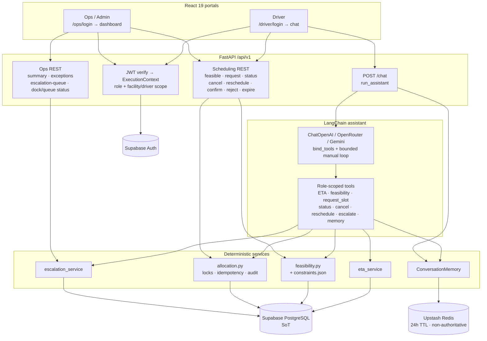
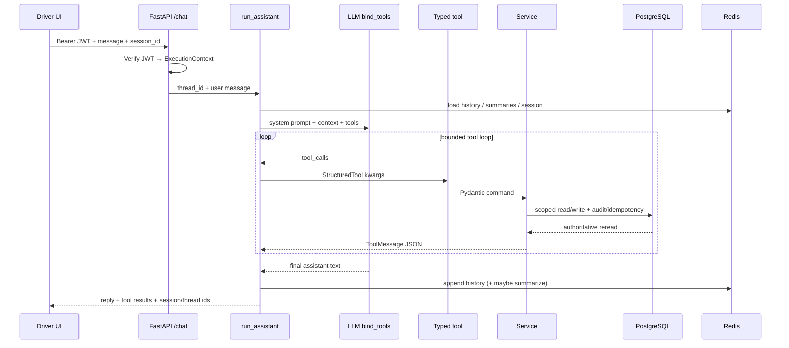
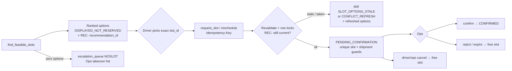

# SetuHaul AI

> AI-Powered Driver Exception Management & Dock Scheduling Platform (FDE POC)


---

## Quick start (Sprint 1–3)

**Status:** Sprint 1, Sprint 2, and Sprint 3 exit gates are **complete** (Sprint 3 closed 2026-08-12). Sprint 4 (hosting / AgentCore / Locust) is **planned only** — do not start unless the owner promotes it.

| Sprint | Gate |
|---|---|
| 1 – Trusted walking skeleton | COMPLETE |
| 2 – Exception / ETA vertical slice | COMPLETE |
| 3 – Deterministic feasibility & concurrent allocation | COMPLETE |
| 4 – Hosting, AgentCore, observability, Locust | PLANNED |

**What you can demo today**

- Driver chat with typed tools + confirmed ETA write (idempotent)
- Ops/Admin dashboard refresh seeing matching exceptions / escalations
- Deterministic ranked `find_feasible_slots` (options are **not reserved**)
- Transactional `request_slot` → `PENDING_CONFIRMATION` (idempotent, conflict-safe refresh)
- Appointment status, cancel, reschedule; ops confirm / reject / expire
- Stale recommendation rejection (`SLOT_OPTIONS_STALE`) after ETA / option drift
- No-feasible-slot escalation into durable `escalation_queue` + Ops takeover list
- Scarce-capacity safety: same-slot race + 10×4 concurrent claim (zero double-books)

**What is intentionally out of scope (deferred)**

- Facility-wide OR-Tools / schedule optimizer (PDF §7.3 optional)
- Password rotation / session revocation hardening (post-demo)
- Hosted deploy (Vercel / App Runner / Bedrock AgentCore) — Sprint 4
- Maps, GPS, messaging channels

### Run locally

Use **`http://localhost:5173`** for the UI (CORS allows both localhost and 127.0.0.1).

```bash
# 1) Env (never commit real secrets)
cp .env.example .env
# Fill Supabase, DATABASE_URL, at least one LLM key, Upstash.
# Frontend Vite vars also go in frontend/.env.local (see table below).
# Shared demo passwords live in gitignored POC_TEAM_ACCOUNTS.local.md (owner-shared).

# 2) Backend
cd backend
python -m venv .venv
# Windows: .venv\Scripts\activate
# macOS/Linux: source .venv/bin/activate
pip install -r requirements.txt
uvicorn app.main:app --host 127.0.0.1 --port 8000 --reload

# 3) Frontend (second terminal)
cd frontend
npm install
npm run dev
```

API: `http://127.0.0.1:8000` (root `/` is an alive health ping; also `/health/live`, `/health/ready`, `/docs`) · UI: `http://localhost:5173`

**Reset between shared demos** (undo ETA/slot/chat residue; does not change Auth passwords):

```powershell
python supabase/demo/reset_demo_day.py --mode cast --include-shp1017 --confirm
```

### Environment variables

| Variable | Where | Purpose |
|---|---|---|
| `SUPABASE_URL`, `SUPABASE_ANON_KEY` | root `.env` | Auth / JWKS |
| `VITE_SUPABASE_URL`, `VITE_SUPABASE_ANON_KEY`, `VITE_API_BASE_URL` | `frontend/.env.local` | Browser client |
| `SUPABASE_SERVICE_ROLE_KEY`, `DATABASE_URL` | root `.env` only | Backend DB / admin (never in browser) |
| `LLM_PROVIDER`, `LLM_MODEL` | root `.env` | `auto` \| `openai` \| `openrouter` \| `gemini` |
| `OPENAI_API_KEY` / `OPENROUTER_API_KEY` / `GOOGLE_API_KEY` | root `.env` | LLM (`auto` = OpenAI → OpenRouter → Gemini) |
| `UPSTASH_REDIS_REST_URL`, `UPSTASH_REDIS_REST_TOKEN` | root `.env` | Chat memory (24h TTL, non-authoritative) |
| `LANGSMITH_API_KEY`, `LANGSMITH_TRACING` | root `.env` | Optional tracing |
| `CORS_ORIGINS` | root `.env` | Default includes both Vite origins |
| `SETUHAUL_RUN_LIVE_DB_TESTS=1` | shell only | Opt-in live integration proofs (needs `DATABASE_URL`) |

Copy from [`.env.example`](.env.example). Never commit real keys or passwords.

### Demo login details

Passwords are **not** in git. Owner shares them privately via gitignored `POC_TEAM_ACCOUNTS.local.md`. Keep the **same three shared role buckets** until after demo (no password resets).

| Portal | URL | Email | Role |
|---|---|---|---|
| Driver | `http://localhost:5173/driver/login` | `ravi.kumar@setuhaul.com` (also amit.singh, vikas.sharma, `driver.drv004@…`–`drv015@…`) | DRIVER |
| Ops | `http://localhost:5173/ops/login` | `priya.mehta@setuhaul.com` (also kavita.rao, arvind.nair, …) | facility ops roles |
| Ops | `http://localhost:5173/ops/login` | `admin@setuhaul.com` / `ananya.rao@setuhaul.com` (also meera.iyer, …) | global ops / admin |

These emails are seeded in Supabase Auth and mapped via `users.auth_user_id`. Same password per bucket.

### Demo script (Sprint 2 + Sprint 3)

Demo-day cast anchors **2026-08-16** (`Asia/Kolkata`). **Full ordered manual test:** [docs/DEMO_MANUAL_RUNBOOK.md](docs/DEMO_MANUAL_RUNBOOK.md). Quick prompts: [docs/DEMO_DRIVER_CHAT_SCRIPT.md](docs/DEMO_DRIVER_CHAT_SCRIPT.md). Judge sheet: [docs/DEMO_DAY_READINESS.md](docs/DEMO_DAY_READINESS.md).

1. Open Driver login → sign in as **Ravi**.
2. If asked which shipment, choose **`SHP-D16-RAVI`** (not older `SHP1017`).
3. Report delay / confirm an exact ETA with timezone when prompted.
4. Ask for later slots → ranked **non-reserved** options (`find_feasible_slots`).
5. Request an exact `slot_id` → `PENDING_CONFIRMATION` (`request_slot`). Check status; warehouse has not confirmed yet.
6. Optional: cancel → slot capacity frees for a later search.
7. Two browsers: Ravi (`SHP-D16-RACE-A`) and Amit (`SHP-D16-RACE-B`) both request **`D16-SLT-RACE`** → one winner, one conflict refresh.
8. **Vikas:** slots for **`SHP-D16-NOSLOT`** → zero options + escalation (no invented slot); Ops sees the escalation queue.
9. Ops login → dashboard / escalation list → confirm or reject a pending appointment.

### LLM providers

Runtime uses a bounded manual `run_assistant` loop with **`bind_tools`** (not `create_agent` / AgentExecutor).

| Provider | Env | LangChain class |
|---|---|---|
| OpenAI | `OPENAI_API_KEY` | `ChatOpenAI` |
| OpenRouter | `OPENROUTER_API_KEY` | `ChatOpenAI` + OpenRouter base URL |
| Gemini | `GOOGLE_API_KEY` (Google AI Studio / Gemini API) | `ChatGoogleGenerativeAI` (default `gemini-flash-latest`) |

- `LLM_PROVIDER=auto` (default): first available among OpenAI → OpenRouter → Gemini
- Explicit: set `LLM_PROVIDER=openai|openrouter|gemini` and that provider’s key
- Optional `LLM_MODEL` overrides the default model for the chosen provider
- Do **not** put an OpenAI `sk-` / `sk-proj-` key in `GOOGLE_API_KEY`; default Gemini model is `gemini-flash-latest`.

---

## Overview

SetuHaul is an FDE logistics POC: drivers report delays and update ETA through a conversational assistant; the system returns deterministic, explainable slot options and concurrency-safe appointment claims; operations see facility-scoped (or global Admin) dashboards and an escalation queue for human takeover. PostgreSQL (Supabase) is the business source of truth; Upstash Redis holds bounded conversation/session state only (24h TTL, non-authoritative).

---

## POC portals

| Portal | Routes |
|---|---|
| Driver | `/driver/login` → driver chat home (ETA + scheduling tools) |
| Operations | `/ops/login` → shared Operator/Admin dashboard + escalation list (JWT sets facility vs global RO) |

---

## Architecture (how we use it through Sprint 3)

Two portals share one FastAPI BFF. The LLM never books slots or invents ETAs — it only orchestrates **typed tools** that call deterministic services. PostgreSQL is the business source of truth; Upstash Redis is 24h non-authoritative chat/session memory only.

### System context



### Driver chat turn (exact path)



### Scarce-capacity allocation (exact path)



Packages: `backend/app/assistant/` (LLM factory, `run_assistant`, tools, prompts) and `backend/app/scheduling/` (`feasibility.py`, `allocation.py`, `constraints.json`). Full write-up: [docs/ARCHITECTURE.md](docs/ARCHITECTURE.md).

---

## Technology stack

| Layer | Technology |
|---|---|
| Frontend | React 19 + TypeScript + Vite |
| Backend | FastAPI (thin routers → services → repositories) |
| AI | LangChain `bind_tools` manual loop (OpenAI / OpenRouter / Gemini) |
| Scheduling | Deterministic feasibility + transactional allocation (PostgreSQL locks / unique indexes) |
| Database | Supabase PostgreSQL |
| Memory | Upstash Redis (24h TTL, non-authoritative) |
| Auth | Supabase Auth + server-side JWT verification |
| Observability | Optional LangSmith |

---

## Project layout

```
SetuHaul/
├── backend/app/          # FastAPI API + assistant + scheduling + services
├── frontend/             # React 19 frontend
├── supabase/migrations/  # SQL migrations
├── supabase/demo/        # Demo-day 2026-08-16 generator + cast fixtures
├── plans/                # Living master plan + branch plans
├── wiki/                 # LLMWiki (handoff, current-state, …)
├── docs/                 # Architecture / ADRs / demo readiness / scripts
├── .env.example
├── PROJECT.md
└── README.md
```

---

## Documentation

| File | Description |
|---|---|
| [PROJECT.md](PROJECT.md) | Product scope |
| [plans/implementation-master-plan.md](plans/implementation-master-plan.md) | Delivery order / living scoreboard |
| [wiki/handoff.md](wiki/handoff.md) | Latest session handoff |
| [docs/DEMO_DAY_READINESS.md](docs/DEMO_DAY_READINESS.md) | Judge-facing demo readiness vs FDE PDF |
| [docs/DEMO_MANUAL_RUNBOOK.md](docs/DEMO_MANUAL_RUNBOOK.md) | Ordered manual demo + stress steps (chat lines + pass/fail) |
| [docs/DEMO_DRIVER_CHAT_SCRIPT.md](docs/DEMO_DRIVER_CHAT_SCRIPT.md) | Quick Ravi chat prompts |
| [docs/ARCHITECTURE.md](docs/ARCHITECTURE.md) | System architecture |
| [docs/DATABASE.md](docs/DATABASE.md) | Database design |
| [docs/API.md](docs/API.md) | API contracts |
| [AGENTS.md](AGENTS.md) | Agent / writeback policy |

---

## Testing

```bash
cd backend
pytest tests/unit

# Opt-in live scarce-capacity proofs (needs DATABASE_URL)
# SETUHAUL_RUN_LIVE_DB_TESTS=1 pytest tests/integration/test_live_demo_day_load.py
# SETUHAUL_RUN_LIVE_DB_TESTS=1 pytest tests/integration/test_live_scheduling_concurrency.py
```

CI runs backend unit tests + frontend `npm run build` (see `.github/workflows/ci.yml`). Live DB integration tests are opt-in and skipped by default.

---

## Coding standards (POC)

- FastAPI routers stay thin; business rules in services; persistence in repositories
- LLM orchestrates typed tools only — never executes SQL or invents operational facts
- Appointment writes are transactional, idempotent, audited, and revalidated against PostgreSQL
- Never commit secrets, service-role keys, or POC passwords
- Identity and scope come from verified JWT claims, not client-supplied ownership IDs

---

## License / acknowledgements

Educational FDE Challenge portfolio work. Thanks to FDE Academy, LangChain, FastAPI, Supabase, and Upstash.
