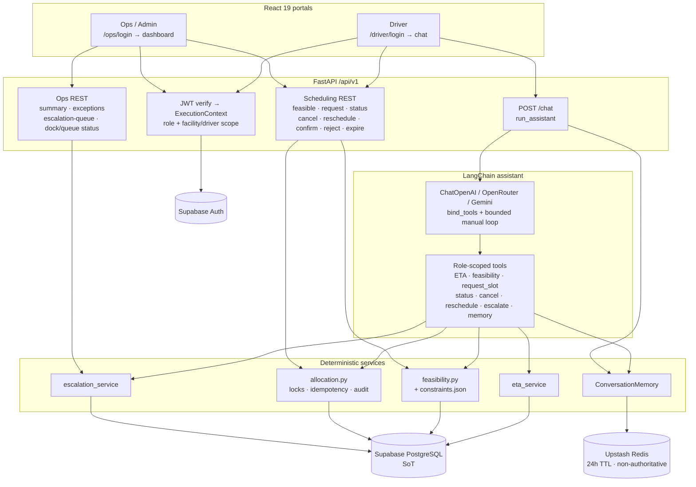
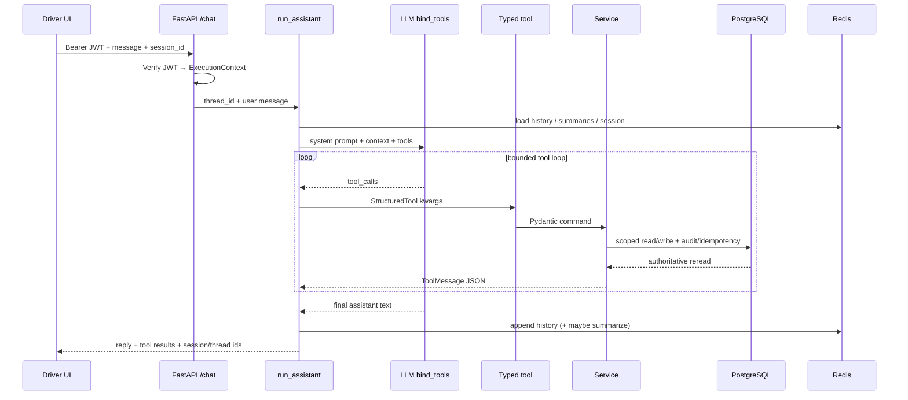
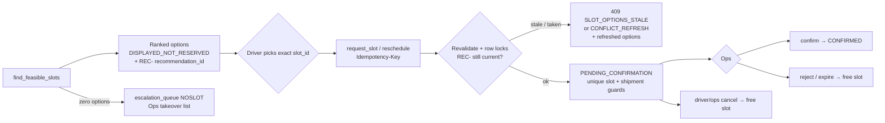
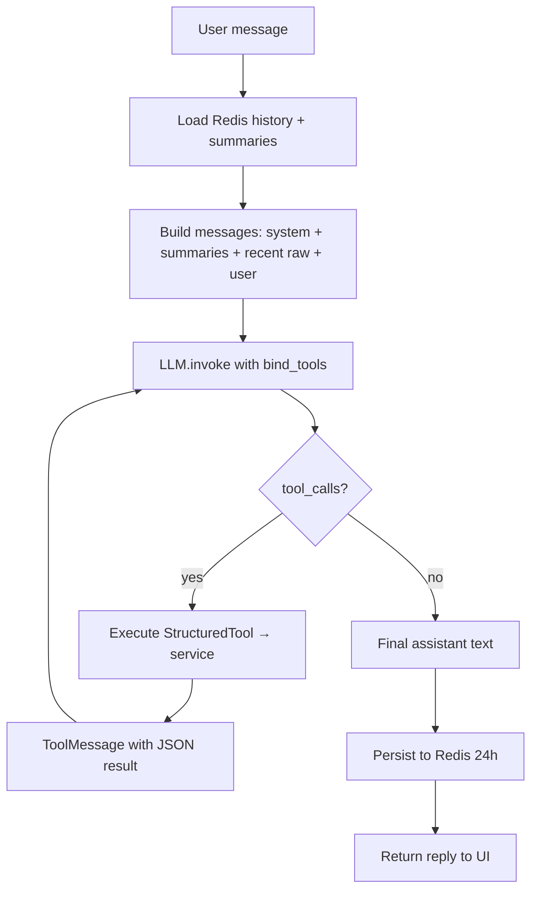
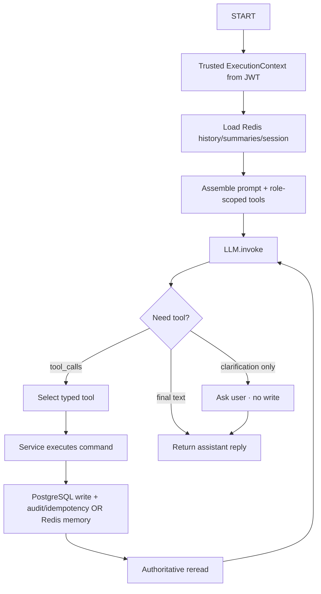

# SetuHaul AI
# System Architecture

Version: 1.0

---

# Purpose

This document defines the complete technical architecture of the SetuHaul AI platform.

It explains:

- Overall system architecture
- Application layers
- Component responsibilities
- AI architecture
- Authentication flow
- Database interactions
- Redis usage
- LangChain integration
- Monitorin with LangSmith, AgentCore, CloudWatch
- Folder structure
- Deployment architecture

This document does not define API contracts or database schemas. Those are documented separately.

---

# High Level Architecture

Status through **Sprint 3** (gate COMPLETE 2026-08-12): two React portals, one FastAPI BFF, LangChain `bind_tools` + bounded manual loop, deterministic scheduling services, Supabase PostgreSQL SoT, Upstash Redis 24h conversation memory only.

## How we use it (exact)

| Actor | Entry | What happens |
|---|---|---|
| Driver | `/driver/login` → chat | Supabase Auth → JWT → FastAPI builds `ExecutionContext` → `POST /api/v1/chat` → `run_assistant` → LLM with role-scoped tools → services → PostgreSQL / Redis |
| Ops / Admin | `/ops/login` → dashboard | Same Auth path → Ops REST (summary, exceptions, escalation queue, dock/queue status) + confirm/reject/expire appointment REST |
| LLM | never | Never executes SQL, never invents ETA/slot/capacity facts, never marks appointments `CONFIRMED` |
| Scheduling engine | `feasibility` + `allocation` | Pure deterministic code + `constraints.json`; Postgres unique indexes enforce one active claim per slot/shipment |

## System context (Mermaid)



## Driver chat turn (Mermaid)



## Scarce-capacity allocation (Mermaid)



ASCII sketch (same topology):

```
Driver / Ops (React 19)
        │
        ▼
   FastAPI (/api/v1)  ← JWT ExecutionContext
        │
   ┌────┼────────────┐
   ▼    ▼            ▼
 Chat  Scheduling   Redis
(tools) + Ops REST  (24h memory)
   │     │
   └─────┼─────► Supabase PostgreSQL (SoT)
               feasibility · allocation · escalation_queue
```

---

# Architecture Principles

The application follows the following principles.

- Modular
- Layered
- Service Oriented
- AI First
- Stateless APIs
- Role Based Access
- Production Ready

---

# Technology Stack

## Frontend

React

TypeScript

Vite

TailwindCSS

Shadcn UI

React Query

React Router

Chart.js

Hero Icons

---

## Backend

FastAPI

Python 3.12+

Pydantic

SQLAlchemy

Alembic

---

## AI

LangChain

OpenAI (ChatOpenAI via LangChain)

LangSmith, CloudWatch, AgentCore

---

## Database

Supabase PostgreSQL

---

## Cache

Redis with UpStash

---

## Deployment

Docker

Docker Compose

NGINX

---

# Application Layers

```
Frontend

↓

API Layer

↓

Authentication

↓

Business Services

↓

AI Layer

↓

Tool Layer

↓

Database

↓

Redis
```

Each layer has one responsibility.

---

# Frontend Architecture

```
frontend/

resources/

src/

components/

pages/

layouts/

hooks/

services/

types/

assets/

styles/

utils/

router/
```

The existing Stitch generated HTML/CSS must be converted into reusable React components.

No UI redesign is required.

---

# Backend Architecture

```
backend/

app/

api/

routers/

services/

ai/runtime/

tools/

database/

models/

schemas/

middleware/

auth/

config/

prompts/

utils/

core/

main.py
```

---

# Layer Responsibilities

## API Layer

Responsibilities

- Receive HTTP requests
- Validate input
- Return responses

No business logic.

---

## Service Layer

Responsibilities

- Business rules
- Database operations
- Validation
- Transactions

---

## Tool Layer

LangChain tools call the Service Layer.

Examples

- Lookup Shipment
- Lookup Driver
- Update ETA
- Book Appointment
- Cancel Appointment
- Find Available Slots

Tools must never execute raw SQL.

---

## AI Layer

The AI layer is responsible for

- Intent Detection
- Context Management
- Tool Selection
- Response Generation

The AI layer never directly modifies the database.

---

# AI Architecture

Runtime shape (ADR 011): **not** `create_agent` / AgentExecutor. One assistant per request uses `bind_tools` on a curated Driver allowlist and a custom bounded invoke loop.



Tool calls always land in application services (`eta_service`, `feasibility`, `allocation`, `escalation_service`, `driver_reads`, `ConversationMemory`). Services enforce scope from `ExecutionContext`, never from client-supplied ownership IDs.

---

# LangChain LLM Invoke Flows

Exact loop implemented in `backend/app/assistant/run_assistant.py`:



Clarification (e.g. repair duration ≠ ETA) happens before mutation tools commit. Scheduling tools never invent slots; zero options escalate to `escalation_queue`.

---

# AI Tools

The assistant uses deterministic, role-scoped tools. Driver allowlist (Sprint 3) includes:

- `get_driver_profile` / operational context reads
- `get_latest_eta`, `get_eta_history`, `get_current_appointment`
- `get_facility_details`, `get_exception_status`
- `report_delay_or_update_eta` (confirm exact ETA before write)
- `find_feasible_slots` (non-reserved options + `REC-` id)
- `request_slot`, `get_appointment_request_status`
- `cancel_appointment`, `reschedule_appointment`
- `escalate_exception`
- `get_conversation_memory`

Ops appointment confirm / reject / expire are REST (ops/admin), not Driver chat tools. Each tool calls the corresponding service; the LLM never runs SQL.

---

# Authentication Architecture

Authentication uses Supabase Authentication.

After successful login

```
User

↓

Supabase Auth

↓

JWT Token

↓

FastAPI

↓

User Lookup

↓

Role Validation

↓

Response
```

The application should never store plaintext passwords.

---

# Role Based Access

## Driver

Accessible Pages

- Login
- AI Assistant

---

## Operations Users

Accessible Pages

- Login
- AI Assistant
- Operations

---

## Administrator

Full access.

---

# Operations Module

Operations consists of tab-based pages.

```
Operations

├── Dashboard

├── Shipments

├── Appointments

├── Drivers

├── Facilities

├── Exceptions

├── Analytics

└── Settings
```

---

# Redis Architecture

Redis will be used for

## Conversation Memory

Store active conversations.

TTL: 24 hours

---

## LangChain Conversation Memory

Persist bounded conversation history and session context in Upstash Redis with a 24-hour TTL.

The assistant uses `ChatOpenAI.bind_tools(role_scoped_tools)` plus a custom bounded invoke loop per request (`invoke` → tool_calls → service-backed ToolMessages → final text). Do not use `create_agent`, `AgentExecutor`, or `create_react_agent`. Tools call FastAPI application services only (no SQL); PostgreSQL remains SoT; the LLM never invents operational facts.

---

## Session Cache

Store user sessions.

---

## Frequently Used Queries

Cache

- Dashboard KPIs
- Facility Summary
- Available Slots
- Driver Details

---

# Database Access

All database operations follow

```
Router

↓

Service

↓

Repository

↓

SQLAlchemy

↓

PostgreSQL
```

Routers never execute SQL.

---

# Logging

Three types of logging are required.

Application Logs

Python logging.

Audit Logs

Stored in audit_logs.

API Logs

Stored in api_logs.

---

# Error Handling

All APIs return

```json
{
  "success": true,
  "message": "",
  "data": {},
  "errors": [],
  "timestamp": "",
  "request_id": ""
}
```

---

# Folder Structure

```
SetuHaul-AI/

frontend/

│

├── resources/

├── src/

│ ├── components/

│ ├── pages/

│ ├── layouts/

│ ├── services/

│ ├── hooks/

│ ├── router/

│ ├── assets/

│ └── types/

backend/

│

├── app/

│ ├── api/

│ ├── auth/

│ ├── ai/runtime/

│ ├── services/

│ ├── tools/

│ ├── routers/

│ ├── middleware/

│ ├── database/

│ ├── models/

│ ├── schemas/

│ ├── prompts/

│ ├── utils/

│ └── core/

database/

docs/

tests/

.env

requirements.txt

README.md
```

---

# Sequence Diagram

```
Driver

↓

React

↓

FastAPI

↓

LangChain

↓

Tool

↓

Service

↓

Repository

↓

PostgreSQL

↓

Tool

↓

LangChain

↓

FastAPI

↓

React
```

---

# Non Functional Requirements

- Response time under 2 seconds for standard queries.
- Modular architecture.
- Scalable backend.
- Stateless APIs.
- Secure authentication.
- Structured logging.
- Type-safe backend.
- Reusable frontend components.
- Docker-ready deployment.

---

# Future Enhancements

The architecture should support future additions without major refactoring.

Potential enhancements include:

- WhatsApp integration
- Microsoft Teams integration
- Voice-based driver assistant
- Live GPS integration
- Real-time notifications
- OR-Tools scheduling engine
- Multi-tenant deployment
- Multi-language support
- Predictive ETA models
- AI-powered operational analytics

These enhancements should integrate with the existing architecture without requiring significant changes to the core system.
