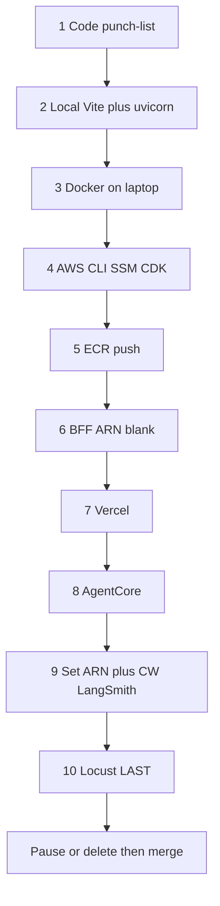
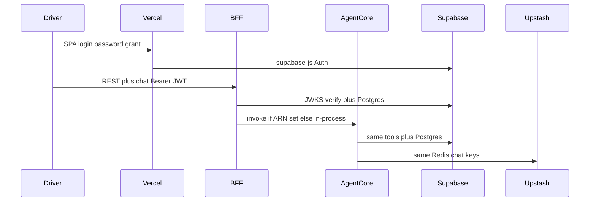
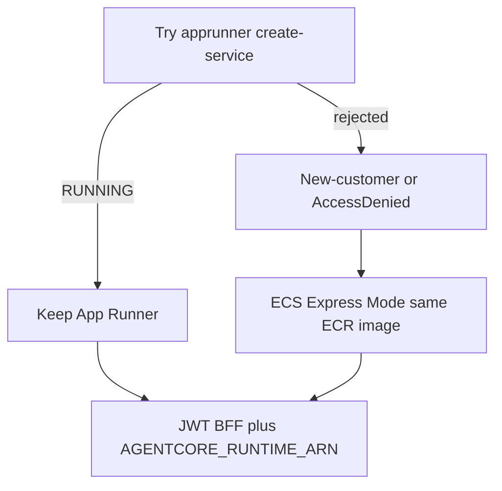
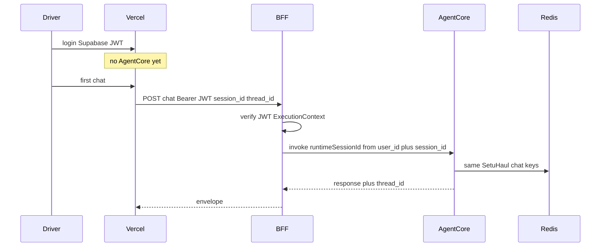

# Sprint 4 hosting scoreboard

Status: **PLANNED — locked 2026-08-13 23:25 IST.** Owner: follow this file. Do not switch to GitHub Actions deploy, a different BFF host, or a different step order unless this file is updated first.  
Living sprint: Sprint 1–3 exit gates **COMPLETE**. Sprint 4 exit gate remains **OPEN** until hosted smoke.  
Canonical delivery order: [`implementation-master-plan.md`](implementation-master-plan.md) §8.1. **This file** is the Sprint 4 hosting command book, work order, and compatibility punch-list.

**Branch rule (updated 2026-08-14 01:46 IST):** Owner lifted the `hosting`-only lock. Vercel production tracks **`main`**. Merge `hosting` → `main` now so SPA rewrites and host-readiness code ride the existing production project. Further Sprint 4 work continues on `main`. The same git commit must still run locally. Do **not** strike the Sprint 4 exit gate until Steps 7–10 have evidence. Step order and “Actions stays CI-only” are unchanged.

Do not put secrets, tokens, passwords, or account IDs with credentials in this file. Placeholders only: `ACCOUNT_ID`, `PASTE`, `PASTE_ARN`. Region: **us-east-1**. Who: account owner or IAM user `setuhaul-deploy-aman` (AdministratorAccess on the owner’s $100-credit trial). Daily coding is local and costs $0 AWS.

---

## Do this first → last (do not skip)

Work **down this list**. Do not start a later step until the earlier one is done. Locust is **last**. Striking the Sprint 4 gate is **after last**.

| Order | What | Done when | Commands |
|---|---|---|---|
| **1 FIRST** | Code punch-list (landed on `hosting`, merging to `main`) | Chat alias, CORS setting, Dockerfile, `vercel.json`, `AGENTCORE_RUNTIME_ARN` (blank), LangSmith project name `setuhaul-agentcore` | Application work — see §1 punch-list |
| **2** | Prove **local** (ARN blank) | **PASS 2026-08-14 00:12 IST** — Login + REST + Driver chat on Vite `:5173` / uvicorn `:8000` | §5.10 |
| **3** | Prove **Docker** on the laptop | **PASS 2026-08-14 00:20 IST** — `GET /health/live` 200; same chat through the container | §5.4 local `docker run` |
| **4** | AWS once: CLI, CDK bootstrap, billing $20/$50, SSM secrets | **PASS 2026-08-14 00:28 IST** — identity + `/setuhaul/*` names (billing budgets still console) | §5.0–5.3 |
| **5** | Build/push ECR image (`linux/amd64`) | **PASS 2026-08-14 00:45 IST** — Image in `setuhaul-api` | §5.4 |
| **6** | Host the BFF — **ARN still blank** | **PASS 2026-08-14 01:00 IST** — Express Mode after App Runner reject; `/health/live` 200; ALB idle 180s | §5.5 |
| **7** | Host the SPA on Vercel | **PASS 2026-08-14 01:51 IST** — `setuhaul-roan.vercel.app` from `main` `91cb6bb`; login routes 200; Ravi `/auth/me` + in-process chat 200 | §5.9 |
| **8** | AgentCore (only after local chat already works) | **PASS 2026-08-14 02:28 IST** — Runtime READY; CLI invoke `list_active_shipments`; ARN in `.env` only; BFF ARN still blank | §5.6 |
| **9** | Point BFF at AgentCore | **PASS 2026-08-14 02:52 IST** — Express ARN set; hosted Ravi chat through Runtime; CW + LangSmith `setuhaul.chat` | §5.5 + §5.7 |
| **10 LAST** | Locust | Suite A chat + suite B scarce slots; **zero** double-books; CW spike; LangSmith traces | §5.8 |
| **After last** | Save credits | Pause App Runner **or delete** Express Mode. Strike Sprint 4 gate only with Steps 7–10 evidence | §6 |



**Do not:**

- Run Locust before steps 7–9 are up.
- Deploy AgentCore before step 2 chat works.
- Build Vercel before you have the BFF URL from step 6.
- Set `AGENTCORE_RUNTIME_ARN` before step 8 is deployed.
- Merge to `main` or strike the Sprint 4 gate before step 10 evidence.
- Replace this command book with GitHub Actions CD for the **first** host. Keep [`.github/workflows/ci.yml`](../.github/workflows/ci.yml) for pytest + frontend build. Optional ECR/OIDC Actions only **after** steps 6–9 have worked once. Never put AWS keys in GitHub secrets.

---

## 0. Dual-mode (local is first-class)

| Mode | Frontend | API / BFF | Assistant | `AGENTCORE_RUNTIME_ARN` |
|---|---|---|---|---|
| Local | Vite `:5173` | uvicorn `:8000` | in-process `run_assistant` | **blank** |
| Hosted | Vercel | App Runner **or** ECS Express Mode | Bedrock AgentCore Runtime | set **only** on the hosted BFF after AgentCore is up |

```text
Laptop:  Vite → uvicorn → run_assistant
Hosted:  Vercel → FastAPI BFF (JWT) → IAM invoke AgentCore → same run_assistant
```

The SPA never holds AWS credentials. AgentCore **hosts** the assistant; it does not replace Gemini/OpenAI, LangChain, Postgres, or Upstash. AgentCore Memory stays **off**. Redis remains `setuhaul:chat:{user_id}:session:{session_id}:thread:{thread_id}:history` with a 24-hour TTL.

If local login + REST + Driver chat work on a commit, deploy **that commit**.

---

## ARN vs hosted URL (when each is needed)

There are **two HTTPS URLs**. The ARN is **not** a URL and is **never** in the browser.

| Thing | What it is | Who uses it | When required |
|---|---|---|---|
| Vercel URL | SPA (`https://….vercel.app`) | Driver/Ops in the browser | Step 7. This is the “hosted site.” |
| BFF URL | FastAPI (`https://….amazonaws.com` or App Runner URL) | The SPA, via `VITE_API_BASE_URL` | Step 6. Login, REST, Ops, **and** chat all go here. |
| `AGENTCORE_RUNTIME_ARN` | AWS resource name of the AgentCore Runtime, e.g. `arn:aws:bedrock-agentcore:us-east-1:ACCOUNT:runtime/SetuHaulAgent-…` | **Only the BFF** (env on App Runner / ECS). Not Vercel. Not `VITE_*`. | **Step 9 only.** Blank until then. |

**Hosted URL does not use the ARN.** Vercel is built with:

```text
VITE_API_BASE_URL=https://<BFF-URL>
```

[`frontend/src/core/http/api.ts`](../frontend/src/core/http/api.ts) then does `fetch(VITE_API_BASE_URL + '/api/v1/chat')` with the Supabase JWT. Same pattern as localhost (`http://localhost:8000`). You do **not** rebuild Vercel when you later set the ARN.

**ARN is a switch inside FastAPI chat**, after JWT is verified:

```text
Steps 2–7:  ARN blank  →  BFF calls run_assistant in-process  (today’s chat.py)
Step 8:     AgentCore exists, but BFF still ignores it until you set the env
Step 9:     ARN set on BFF  →  BFF InvokeAgentRuntime(ARN, runtimeSessionId, payload)
            AgentCore runs the same run_assistant
Laptop:     ARN always blank  →  never calls AWS
```

Login, `/auth/me`, Ops dashboard, dispatch, slot REST **never** need the ARN. Only Driver **chat** uses it, and only on the hosted BFF after step 9.

Today’s [`chat.py`](../backend/app/api/v1/routers/chat.py) calls `run_assistant` in-process when `AGENTCORE_RUNTIME_ARN` is blank, and `InvokeAgentRuntime` when it is set.

---

## 1. Compatibility verdict (2026-08-13)

**The topology works.** Same commit can stay local and go live. **Step 1 code is in** (chat alias, CORS regex, Dockerfile, vercel.json, ARN switch). **Step 2 local smoke PASS** 2026-08-14 00:12/00:16 IST. **Step 3 Docker PASS** 2026-08-14 00:20 IST. **Step 4 SSM PASS** 2026-08-14 00:28 IST. **Step 5 ECR PASS** 2026-08-14 00:45 IST. **Step 6 BFF PASS** 2026-08-14 01:00 IST. **Step 7 Vercel PASS** 2026-08-14 01:51 IST. **Step 8 AgentCore PASS** 2026-08-14 02:28 IST (CLI invoke). **Step 9 BFF ARN PASS** 2026-08-14 02:52 IST (hosted chat through Runtime; CW + LangSmith). Locust remains Step 10.



BFF = App Runner if this AWS account is an **existing** App Runner customer, else **ECS Express Mode** with the same ECR image.

### Already compatible

- React 19 Vite SPA (`frontend/package.json`) on Vercel; FastAPI Python 3.12 (`backend/pyproject.toml`) in Docker.
- `GET /health/live` returns HTTP 200 (JSON envelope). Use this path for load-balancer health, not `/health/ready`.
- Browser talks to Supabase Auth; FastAPI verifies JWKS (`backend/app/core/security.py`). Password grant does not need OAuth redirect URLs.
- `backend/app/db/session.py` already sets `statement_cache_size=0` for PgBouncer. Hosted `DATABASE_URL` must be the **IPv4 pooler** (`…pooler.supabase.com:6543`), not `db.*.supabase.co:5432` (often IPv6-only; Fargate is IPv4).
- Upstash REST and Gemini/OpenAI/OpenRouter are HTTPS. No VPC required.
- Dual-mode: ARN blank = in-process chat (what local already is).
- AgentCore in `us-east-1`. CodeZip 250 MB compressed is enough if the zip is **backend only** (exclude `frontend/node_modules`, `.venv`, `agentcore/cdk`).
- Session model already matches hosted needs: JWT `user_id` + browser `session_id` + `thread_id`.

### Punch-list (Step 1 FIRST — must fix before any deploy)

Code landed 2026-08-13 23:50 IST (unit tests **77 passed**). Local Driver chat **PASS** 2026-08-14 00:12 IST. Docker smoke **PASS** 2026-08-14 00:20 IST.

1. **Chat path.** ~~`DriverHome.tsx` posts `/api/v1/chat/message`. `chat.py` only has `POST /api/v1/chat`.~~ Both `POST /api/v1/chat` and `/api/v1/chat/message` call the same handler.
2. **CORS.** Localhost origins plus `CORS_ORIGIN_REGEX` default `https://.*\.vercel\.app`. Add the exact production Vercel URL to `CORS_ORIGINS` when you have it.
3. **`backend/Dockerfile`.** Listens `0.0.0.0:${PORT:-8000}`; `uv sync` from `pyproject.toml`/`uv.lock`; `AGENTCORE_RUNTIME_ARN` blank by default. Build `--platform linux/amd64`.
4. **`frontend/vercel.json`.** SPA rewrite to `index.html`.
5. **ALB idle timeout.** Raised to **180s** on Express Mode ALB (2026-08-14 01:00 IST).
6. **Settings.** `AGENTCORE_RUNTIME_ARN` blank local; if set, chat invokes AgentCore; else in-process `run_assistant`.
7. **LangSmith project.** Default `setuhaul-agentcore` (`LANGSMITH_PROJECT`). Run name `setuhaul.chat`.
8. **AgentCore OTEL deps.** Optional extra `agentcore` on `pyproject.toml` (not in the BFF image by default). Histograms no-op if OTEL is missing.

### Compatible with care

- App Runner is **closed to new customers** (announced 2026-03-31; new-customer cutoff 2026-04-30). Probe once; on reject use Express Mode.
- Express Mode creates an **ALB that bills while idle**. Delete after demo. Do not treat it like App Runner `pause-service`.
- Express Mode needs a default VPC (normal on a new account) and two IAM roles: `ecsTaskExecutionRole` + `ecsInfrastructureRoleForExpressServices`.
- Vercel `VITE_*` is bake-time. Set `VITE_API_BASE_URL` to the BFF HTTPS URL **before** the Vercel build.
- AgentCore CodeZip is ARM64. Fargate image is typically `linux/amd64`. Different artifacts — do not pack Windows `.so` wheels into the zip.

---

## 2. App Runner vs ECS Express Mode

AWS docs (checked 2026-08-13):

- [CreateService](https://docs.aws.amazon.com/apprunner/latest/api/API_CreateService.html): new customers starting 2026-03-31.
- [What’s new 2026-03-31](https://aws.amazon.com/about-aws/whats-new/2026/03/aws-service-availability/): new customers starting **2026-04-30**.
- [Availability change](https://docs.aws.amazon.com/apprunner/latest/dg/apprunner-availability-change.html): **no longer open to new customers**. Existing customers can still create services. Recommended replacement: [ECS Express Mode](https://docs.aws.amazon.com/AmazonECS/latest/developerguide/express-service-overview.html).

A free-trial account in August 2026 is a **new customer**. `aws apprunner create-service` will almost certainly fail. Probe for 30 seconds; do not debug App Runner for hours.



Same Docker image, port **8000**, health **`/health/live`**. Application code does not change.

---

## 3. Hosted Driver session

Login does **not** create an AgentCore session. Chat does.

| ID | Where | Role |
|---|---|---|
| JWT → `ExecutionContext.user_id` | FastAPI after JWKS verify | Auth. Not an AgentCore id. |
| `session_id` | Browser `localStorage` / `sessionStorage` (`setuhaul:driver-conversation:{userId}` in `DriverHome.tsx`) | Memory namespace. Survives re-login in the same browser. |
| `thread_id` | Returned by `run_assistant` (`THR-LIVE-…`) | Redis conversation thread. |
| `runtimeSessionId` | Computed on the **BFF** from verified `user_id` + `session_id` | AgentCore sticky Runtime session. Never typed in the UI. Never contains JWT or role. |

Redis key stays `setuhaul:chat:{user_id}:session:{session_id}:thread:{thread_id}:history` (24h). AgentCore Memory stays off.

```text
CLI smoke:  $SESSION = "setuhaul-dev-session-000000000000000001"
            (long sticky id so invoke #1 and #2 share one Runtime session)
Hosted:     browser session_id + JWT user_id → BFF sets runtimeSessionId
Locust:     each virtual user gets locust-session-<uuid>
```



Same Driver, same browser session → same `runtimeSessionId` → CloudWatch sessions + Redis continuity. New browser / new `session_id` → new AgentCore session. Locust uses a unique `runtimeSessionId` per virtual user; Redis keys still include that driver’s `user_id`.

---

## 4. Same order, with pass/fail checks

This is the table above, spelled out. Stop at the first fail.

### Step 1 — FIRST: code punch-list

Punch-list in §1. No AWS spend.

**Pass:** `POST /api/v1/chat` and `/api/v1/chat/message` both work; Dockerfile exists; `vercel.json` rewrites; `AGENTCORE_RUNTIME_ARN` setting exists and is blank locally; LangSmith project name is `setuhaul-agentcore`.

### Step 2 — local app

Vite + uvicorn, ARN blank. Login, REST, Driver chat.

**Pass:** Ravi can chat on `localhost:5173` against `:8000`. **Evidence 2026-08-14 00:12 IST API + 00:16 IST browser:** ARN blank; Ravi grant 200; `/auth/me` USR001/DRIVER/DRV001; `/driver/context` SHP-D16-RACE-A; `POST /api/v1/chat/message` 200. Browser `/driver` as Ravi; composer “Do I have a current appointment?” → no active appointment; uvicorn `POST /api/v1/chat/message` 200.

### Step 3 — local Docker

`docker run` the API image. Hit `/health/live`. Chat through the container if you point Vite at it.

**Pass:** health 200. **Evidence 2026-08-14 00:20 IST:** `setuhaul-api:step1` as `setuhaul-step3` `-p 18000:8000` (laptop uvicorn kept `:8000`); `/health/live` **200** healthy; Ravi `/auth/me` `USR001`/`DRV001`; `POST /api/v1/chat/message` **200** `list_active_shipments`. ARN blank. Container stopped after smoke.

### Step 4 — AWS account (once)

CLI login, CDK bootstrap, billing alarms, SSM SecureString names only.

**Pass:** `get-caller-identity` + SSM name list (no `--with-decryption` in chat). **Evidence 2026-08-14 00:28 IST:** owner `aws login` as root `us-east-1`; eight `/setuhaul/*` names; `database-url` pooler `:6543`; CDK bootstrap already present; `setuhaul-deploy-aman` exists. Billing $20/$50 budgets still console. Helper `docs/scripts/put_hosting_ssm.py`.

### Step 5 — ECR

`linux/amd64` build and push `setuhaul-api`.

**Pass:** image in ECR. **Evidence 2026-08-14 00:45 IST:** `setuhaul-api:latest` in `us-east-1` digest `sha256:250201c7605d…` (same local Step 3 image).

### Step 6 — BFF host (ARN **blank**)

Probe App Runner (~30s). If new-customer reject, ECS Express Mode with the **same** image. Raise ALB idle timeout to 180s. CORS will need the Vercel origin once you have it (step 7); localhost origins stay for laptop testing.

**Pass:** `GET https://<bff>/health/live` 200. **Evidence 2026-08-14 01:00 IST:** App Runner `SubscriptionRequiredException`. Express Mode URL `https://se-e5cad5d30b1a4f22b9aeea032827f81b.ecs.us-east-1.on.aws`; ALB idle 180s; health **200**. ARN blank.

### Step 7 — Vercel

Set `VITE_API_BASE_URL` to the step-6 URL **then** build. Smoke: login, `/auth/me`, Driver chat (still in-process), Ops dashboard.

**Pass:** hosted UI talks to hosted API. This proves hosting even if AgentCore is not up yet. **Evidence 2026-08-14 01:51 IST:** `main` `91cb6bb`; `https://setuhaul-roan.vercel.app/driver/login` **200**; Ravi `/auth/me` + in-process chat **200**.

### Step 8 — AgentCore

Only after step 2 passed. `create` → `validate` → `dev` → `dry-run` → `deploy` → CLI invoke with `$SESSION`.

**Pass:** CLI invoke returns a real assistant reply.

### Step 9 — wire ARN + traces

Set `AGENTCORE_RUNTIME_ARN` on the BFF and redeploy. One Driver chat from Vercel through Runtime. Open CloudWatch GenAI Observability and LangSmith project `setuhaul-agentcore` / run `setuhaul.chat`.

**Pass:** hosted chat via AgentCore + a trace you can screenshot.

### Step 10 — LAST: Locust

Suite A (chat) then suite B (scarce slots, zero double-books). Capture CW spike and LangSmith traces.

**Pass:** ~0% system error; zero double-books.

### After last — credits

Pause App Runner **or delete** the Express Mode service (ALB bills idle). Strike the Sprint 4 gate only with steps 7–10 evidence.

---

## 5. Command book (PowerShell)

Use these **after** you are on the matching step in **Do this first → last**. §5.0–5.3 = step 4. §5.4 = steps 3 and 5. §5.5 = step 6. §5.6 = step 8. §5.7 = step 9. §5.8 = step 10 LAST. §5.9 = step 7. §5.10 = step 2.

Placeholders only. Never paste real keys into chat, screenshots, git, or this file.

### 5.0 Install (once per laptop)

```powershell
node --version   # 20+
npm --version
aws --version    # AWS CLI v2
python --version # 3.12
uv --version
docker --version
cdk.cmd --version
agentcore.cmd --version
# If missing:
# winget install -e --id Amazon.AWSCLI
# npm install -g @aws/agentcore aws-cdk
```

### 5.1 Login and configure

Aman: console first-login + MFA + **his own** access keys (not the owner’s). IAM user name at `https://ACCOUNT_ID.signin.aws.amazon.com/console` — not email.

```powershell
aws configure
# AWS Access Key ID: his key
# AWS Secret Access Key: his secret
# Default region name: us-east-1
# Default output format: json

aws configure set region us-east-1
aws configure list
aws sts get-caller-identity
# Arn must contain setuhaul-deploy-aman (or the owner user). Never paste secrets.
aws sts get-caller-identity --query Account --output text
```

SSO alternative (if the account later switches from IAM user keys):

```powershell
aws login
aws sts get-caller-identity
```

Owner-only IAM check:

```powershell
aws iam get-user --user-name setuhaul-deploy-aman
aws iam list-attached-user-policies --user-name setuhaul-deploy-aman
```

### 5.2 First-time account setup

```powershell
cdk bootstrap aws://ACCOUNT_ID/us-east-1
aws configure get region
```

Billing: Console → Billing → Budgets ($20 / $50). Console is enough for the POC. Deploys spend the owner’s $100 credits.

### 5.3 SSM SecureString (once)

```powershell
aws ssm put-parameter --name "/setuhaul/google-api-key" --type "SecureString" --value "PASTE" --overwrite
aws ssm put-parameter --name "/setuhaul/openai-api-key" --type "SecureString" --value "PASTE" --overwrite
aws ssm put-parameter --name "/setuhaul/upstash-redis-rest-url" --type "SecureString" --value "PASTE" --overwrite
aws ssm put-parameter --name "/setuhaul/upstash-redis-rest-token" --type "SecureString" --value "PASTE" --overwrite
aws ssm put-parameter --name "/setuhaul/langsmith-api-key" --type "SecureString" --value "PASTE" --overwrite
aws ssm put-parameter --name "/setuhaul/database-url" --type "SecureString" --value "PASTE" --overwrite
aws ssm put-parameter --name "/setuhaul/supabase-url" --type "SecureString" --value "PASTE" --overwrite
aws ssm put-parameter --name "/setuhaul/supabase-jwks-issuer-base" --type "SecureString" --value "PASTE" --overwrite

aws ssm get-parameters-by-path --path "/setuhaul" --query "Parameters[].Name"
# Do not get-parameter --with-decryption in screenshots or chat
```

`database-url` must be the **pooler** URL (port 6543, IPv4), not the direct `db.*:5432` host.

Attach SSM read on the AgentCore Runtime role after CDK creates it, and on the BFF task/instance role.

### 5.4 ECR image (shared by App Runner and Express Mode)

```powershell
aws ecr create-repository --repository-name setuhaul-api --region us-east-1
$ACCOUNT = aws sts get-caller-identity --query Account --output text
aws ecr get-login-password --region us-east-1 | docker login --username AWS --password-stdin "$ACCOUNT.dkr.ecr.us-east-1.amazonaws.com"

Set-Location backend
docker build --platform linux/amd64 -t setuhaul-api .
docker tag setuhaul-api:latest "$ACCOUNT.dkr.ecr.us-east-1.amazonaws.com/setuhaul-api:latest"
docker push "$ACCOUNT.dkr.ecr.us-east-1.amazonaws.com/setuhaul-api:latest"
```

Local Docker smoke before push:

```powershell
docker run --rm -p 8000:8000 -e PORT=8000 setuhaul-api
# GET http://127.0.0.1:8000/health/live  → 200
```

### 5.5 Probe App Runner, else ECS Express Mode

**Probe** (expect fail on a new account):

```powershell
aws apprunner create-service --cli-input-json file://deploy/apprunner-create.json
# Stop if the error mentions new customers, not authorized, or AccessDeniedException
```

If it succeeds:

```powershell
aws apprunner list-services
aws apprunner describe-service --service-arn "PASTE_ARN"
aws apprunner start-deployment --service-arn "PASTE_ARN"
# After demo:
aws apprunner pause-service --service-arn "PASTE_ARN"
# aws apprunner resume-service --service-arn "PASTE_ARN"
```

Health: `GET https://<apprunner-url>/health/live`. First deploy: **ARN unset** (in-process chat). After AgentCore: set `AGENTCORE_RUNTIME_ARN` and start-deployment.

Instance role needs `bedrock-agentcore:InvokeAgentRuntime` + SSM read.

**Fallback — same image, ECS Express Mode:**

Create `ecsTaskExecutionRole` and `ecsInfrastructureRoleForExpressServices` once (AWS managed policies per the [Express Mode getting started](https://docs.aws.amazon.com/AmazonECS/latest/developerguide/express-service-getting-started.html) guide). Execution role also needs ECR pull, SSM read, and `bedrock-agentcore:InvokeAgentRuntime`.

```powershell
aws ecs create-express-gateway-service `
  --service-name setuhaul-api `
  --execution-role-arn "arn:aws:iam::ACCOUNT_ID:role/ecsTaskExecutionRole" `
  --infrastructure-role-arn "arn:aws:iam::ACCOUNT_ID:role/ecsInfrastructureRoleForExpressServices" `
  --primary-container '{
    "image": "ACCOUNT_ID.dkr.ecr.us-east-1.amazonaws.com/setuhaul-api:latest",
    "containerPort": 8000,
    "environment": [{"name":"AGENTCORE_RUNTIME_ARN","value":""}]
  }' `
  --health-check-path "/health/live" `
  --scaling-target "{\"minTaskCount\":1,\"maxTaskCount\":2}" `
  --monitor-resources
```

Pass remaining env **names** (CORS, Supabase, DATABASE_URL, LLM, Upstash, LangSmith) via the same `primary-container` or SSM secrets on the task — never commit values.

After the service exists, raise ALB idle timeout (Gemini + tools can exceed 60s). The ALB ARN is on the Express Mode resources tab:

```powershell
aws elbv2 modify-load-balancer-attributes `
  --load-balancer-arn "PASTE_ALB_ARN" `
  --attributes Key=idle_timeout.timeout_seconds,Value=180
```

Redeploy image:

```powershell
aws ecs update-express-gateway-service --service-arn "PASTE_SERVICE_ARN" --primary-container '{"image":"ACCOUNT_ID.dkr.ecr.us-east-1.amazonaws.com/setuhaul-api:latest"}'
```

After demo, **delete** the Express service (ALB bills while idle). Do not leave min=1 running on the $100 trial.

```powershell
aws ecs delete-express-gateway-service --service-arn "PASTE_SERVICE_ARN" --monitor-resources
```

Vercel `VITE_API_BASE_URL` is whichever HTTPS URL won.

### 5.6 AgentCore (SetuHaul names, ERICA lifecycle)

Do not generate or deploy AgentCore until local assistant chat works.

```powershell
agentcore.cmd create --name SetuHaulAgent --framework LangChain_LangGraph --protocol HTTP --model-provider Gemini --memory none --build CodeZip
# set aws-targets.json account from sts
# envVars: LANGSMITH_TRACING=true, LANGSMITH_PROJECT=setuhaul-agentcore only (no keys in json)

agentcore.cmd validate
agentcore.cmd dev --logs

$SESSION = "setuhaul-dev-session-000000000000000001"
# CLI-only sticky id. Not used in the hosted Driver UI.

agentcore.cmd deploy --dry-run --yes
agentcore.cmd deploy --yes
agentcore.cmd status
agentcore.cmd invoke --runtime SetuHaulAgent --session-id $SESSION --prompt-file docs/scripts/agentcore_invoke_ravi.json
agentcore.cmd logs --runtime SetuHaulAgent
```

Thin in-repo entrypoint wrapping async `run_assistant` (no second agent tree, no duplicate tools). CodeZip includes the `backend/app` package plus `backend/pyproject.agentcore.toml` staged to `agentcore/codezip/pyproject.toml` (CDK requires it). CLI `--prompt-file` wraps JSON as a string prompt; `agentcore_main._normalize_runtime_payload` unwraps it. Save Runtime ARN into gitignored `.env` as `AGENTCORE_RUNTIME_ARN` **for the hosted BFF only** (Step 9). Do not set it on Express Mode during Step 8.

### 5.7 CloudWatch / LangSmith

- Console: CloudWatch → GenAI Observability → Bedrock AgentCore
- CLI: `agentcore.cmd logs --runtime SetuHaulAgent`
- LangSmith UI: project `setuhaul-agentcore`, filter Run Name `setuhaul.chat`, remove `Is Trace is true`
- Headline metadata (per turn, not warehouse totals): `last_result_code`, `eta_persisted`, `exception_touched`. Sanitize traces. No LLM-as-a-Judge.

### 5.8 Locust last

```powershell
uv run --with locust --with "boto3[crt]" --with python-dotenv locust -f loadtests/locust_agentcore_chat.py
```

- Suite A: chat via hosted BFF JWT (or `invoke_agent_runtime` with unique session IDs).
- Suite B: scarce slots (`SHP-D16-CONTEND-01..10`); assert **zero** double-books.

Evidence: CloudWatch spike + ~0% system error; LangSmith `setuhaul.chat` + history-size chart.

### 5.9 Vercel (not AWS)

```powershell
# Set VITE_API_BASE_URL to the BFF HTTPS URL before this build
npx vercel --cwd frontend
```

Only `VITE_SUPABASE_URL`, `VITE_SUPABASE_ANON_KEY`, `VITE_API_BASE_URL`. No service-role, LLM, or DB secrets.

### 5.10 Local forever

```powershell
Set-Location backend; uvicorn app.main:app --host 127.0.0.1 --port 8000 --reload
Set-Location frontend; npm run dev
# AGENTCORE_RUNTIME_ARN blank
```

### 5.11 After first deploy — how to update (laptop commands, not Actions CD)

GitHub Actions **already runs on every push/PR** ([`.github/workflows/ci.yml`](../.github/workflows/ci.yml)): pytest + `npm run build`. That is **CI only**. It does **not** push ECR, touch ECS, or deploy Vercel.

Day-2 updates stay the **same PowerShell** as first deploy. Prove local (step 2) on that commit, then pick the row that matches what changed.

| What you changed | Rebuild Vercel? | Command |
|---|---|---|
| FastAPI / tools / `run_assistant` (BFF image) | No | Build/push ECR, then roll the BFF |
| AgentCore entrypoint / assistant code on Runtime | No | `agentcore.cmd deploy --yes` |
| `AGENTCORE_RUNTIME_ARN` or other **BFF env** | No | Update BFF env + redeploy service (no new image required if image unchanged) |
| SSM secret value | No | `ssm put-parameter --overwrite`, then restart/redeploy BFF and/or AgentCore so they re-read it |
| React UI only, **same** BFF URL | Yes | `npx vercel --cwd frontend` (or Vercel Git if connected) |
| BFF URL itself changed | Yes | Set `VITE_API_BASE_URL` to the new BFF URL **then** Vercel build |
| CORS new Vercel origin | No (API image or env) | Set `CORS_ORIGINS` on BFF, redeploy BFF |

**1. Backend image (usual API fix)**

```powershell
$ACCOUNT = aws sts get-caller-identity --query Account --output text
aws ecr get-login-password --region us-east-1 | docker login --username AWS --password-stdin "$ACCOUNT.dkr.ecr.us-east-1.amazonaws.com"
Set-Location backend
docker build --platform linux/amd64 -t setuhaul-api .
docker tag setuhaul-api:latest "$ACCOUNT.dkr.ecr.us-east-1.amazonaws.com/setuhaul-api:latest"
docker push "$ACCOUNT.dkr.ecr.us-east-1.amazonaws.com/setuhaul-api:latest"
```

Then **one** of:

```powershell
# If App Runner won:
aws apprunner start-deployment --service-arn "PASTE_APPRUNNER_ARN"

# If ECS Express Mode won (likely):
aws ecs update-express-gateway-service `
  --service-arn "PASTE_EXPRESS_SERVICE_ARN" `
  --primary-container '{"image":"ACCOUNT_ID.dkr.ecr.us-east-1.amazonaws.com/setuhaul-api:latest"}'
```

**2. Set or change the ARN (step 9 and later)** — Vercel unchanged.

```powershell
# Express Mode example — include the same image plus the new env
aws ecs update-express-gateway-service `
  --service-arn "PASTE_EXPRESS_SERVICE_ARN" `
  --primary-container '{
    "image": "ACCOUNT_ID.dkr.ecr.us-east-1.amazonaws.com/setuhaul-api:latest",
    "containerPort": 8000,
    "environment": [{"name":"AGENTCORE_RUNTIME_ARN","value":"PASTE_RUNTIME_ARN"}]
  }'
```

App Runner equivalent: console or `aws apprunner update-service` with RuntimeEnvironmentVariables, then `start-deployment`.

**3. AgentCore code**

```powershell
agentcore.cmd deploy --dry-run --yes
agentcore.cmd deploy --yes
agentcore.cmd invoke --runtime SetuHaulAgent --session-id $SESSION "Show my shipment"
```

If the Runtime ARN **string** changes, do row 2 as well. If it stayed the same, BFF needs no update.

**4. Frontend**

```powershell
npx vercel --cwd frontend
# VITE_API_BASE_URL must still be the BFF HTTPS URL. Rebuild only if that URL or UI code changed.
```

**CI vs CD (locked)**

```text
git push  →  GitHub Actions CI (tests/build)     ← already there
          →  does NOT deploy AWS or Vercel

update    →  you run the commands above          ← until hosting has worked once
later     →  optional Actions + AWS OIDC to push ECR / update Express Mode
             never store AWS access keys in GitHub secrets
```

---

## 6. Sprint 4 exit gate (after Step 10, not before)

Owner lifted the `hosting`→`main` merge lock on 2026-08-14 01:46 IST (Vercel production tracks `main`). Do **not** strike the Sprint 4 exit gate until all of the following have evidence:

- [x] ~~**Step 7:** Hosted Driver/Ops UI on Vercel talks to the hosted FastAPI BFF (login, `/auth/me`, Ops dashboard).~~ Evidence 2026-08-14 01:51 IST: `https://setuhaul-roan.vercel.app/driver/login` **200**; Ravi `/auth/me` **200**; in-process `POST /chat/message` **200**. Ops UI route `/ops/login` **200**; dashboard click not run.
- [ ] **Steps 7 then 9:** Driver chat works hosted (in-process first, then via AgentCore ARN).
- [ ] **Steps 9–10:** CloudWatch shows Locust traffic with ~0% system error.
- [ ] **Step 9:** LangSmith shows tool-backed `setuhaul.chat` traces (no invented slots).
- [ ] **Step 10 LAST:** Locust contention run proves **zero** double-booking.
- [ ] **After last:** Secrets not in git. App Runner paused **or** Express Mode deleted after the demo.

Until then, Sprint 4 stays **PLANNED / IN PROGRESS**. Further hosting work is on `main`.
